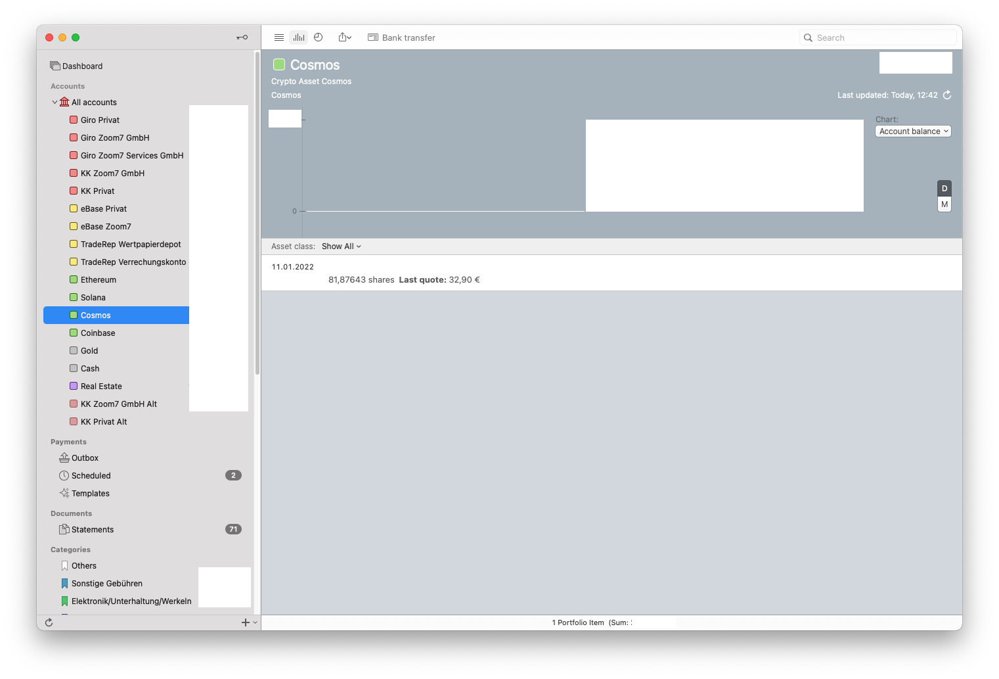

# Cosmos Atom Extension for MoneyMoney
This extension fetches the amount of privately held Cosmos addresses via the official main-api of the Cosmos blockchain project. It then requests the current value in EUR from cryptocompare.com and displays the value of the supplied addresses as securities.

This can be used to track your cold storage.

## Account Setup

Add a new account (type "Cosmos").  
**Use your Ethererum adresses coma seperated as user name**  

`cosmos18n8r0t59xumgqh357ngvx4rsgdk0j47yzv5yjk` (example)

**Put anything in the password field**  
`abc123` (example)